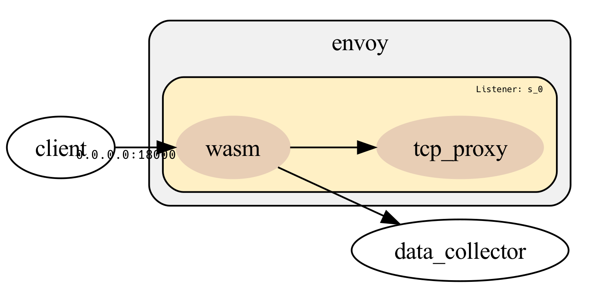

# Goal 
The goal of this lab is demonstrate the envoy wasm with go-sdk.

Global point of view of envoy wasm:  insert <photo>  

The architecture of lab: 

Simple python httpserver that write the body of POST requests into `http.log`

